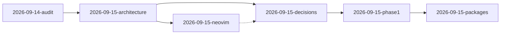

# Девлог — NixOS конструктор

> [!info] О формате
> Каждая запись — отдельная заметка в `docs/devlog/` с YAML-frontmatter. Этот файл — **индекс**. Совместим с **Obsidian** (Dataview, Wikilinks, Tags).
>
> - Создать запись: `docs/devlog/YYYY-MM-DD-slug.md` с frontmatter `title/date/tags`
> - Связи: `[[2026-09-14-audit]]` · Теги: `#devlog` `#nixos`
> - Шаблон — внизу файла

---

## Оглавление (Dataview)

> [!tip] Для Obsidian с плагином Dataview — автотаблица
> Если Dataview не установлен, смотри ручной список ниже.

```dataview
TABLE date as Дата, tags as Теги, decision as Решение
FROM "docs/devlog"
SORT date DESC
```

---

## Хронология (ручной индекс)

| Дата | Заметка | Тип | Статус |
|---|---|---|---|
| 2026-09-14 | [[2026-09-14-audit\|Аудит существующего конфига]] | `audit` | ✅ завершено |
| 2026-09-15 | [[2026-09-15-architecture\|Архитектурное предложение]] | `architecture` | ✅ утверждено |
| 2026-09-15 | [[2026-09-15-neovim\|Исследование Neovim — выбор Lazy.nvim]] | `research` | ✅ решено |
| 2026-09-15 | [[2026-09-15-decisions\|Решения: flat + greetd + Lazy + Obsidian]] | `decision` | ✅ утверждено |
| 2026-09-15 | [[2026-09-15-phase1\|Phase 1 — полная иерархия features сразу]] | `phase` | ✅ evaluation OK |
| 2026-09-15 | [[2026-09-15-packages\|Миграция packages.legacy → features]] | `packages-migration` | ✅ завершено |

---

## Встраивание (Obsidian Embeds)

> [!note] Быстрый просмотр без перехода
> В Obsidian эти секции рендерятся inline.

### ![[2026-09-14-audit#Цель]]

### ![[2026-09-15-architecture#Цель]]

### ![[2026-09-15-neovim#Цель]]

---

## Граф связей



---

## Шаблон новой записи

> [!todo] Скопируй в `docs/devlog/YYYY-MM-DD-slug.md`

```markdown
---
title: "Краткий заголовок"
date: YYYY-MM-DD
tags:
  - nixos
  - devlog
aliases:
  - "YYYY-MM-DD slug"
related:
  - "[[devlog]]"
---

# YYYY-MM-DD — Заголовок

> [!info] Мета
> **Дата:** YYYY-MM-DD · **Тип:** `feature|fix|research` · **Статус:** 🚧 в работе

## Цель

## Что сделано
-

## Результат

## Решения

## Открытые вопросы
- [ ]

## Связи
- Предыдущая: [[...]]
- Документация: [[architecture]]

## Следующий шаг

---
*Теги:* `#devlog`
```

---

## Статистика

- Всего записей: `6`
- Последняя: [[2026-09-15-packages]] (2026-09-15)
- Следующая фаза: `Phase 2 — удаление artlaus/, nix flake check, сборка на железе` (см. [[architecture#10. Следующие шаги (обновлено)|architecture]])

---

*Индекс обновлён: 2026-09-15 · Формат: Obsidian + Dataview + Wikilinks*
